  

  
  
  

  
  
  

---

  <b>The domains I care about most are where backend engineering, system design, and real-world problem solving intersect.</b>

  This page maps the technical domains behind my projects: backend development, API design, distributed systems, microservices, database architecture, and DevOps.

    

## Core Domains

  

## Key Focus Areas

| Area | Purpose |
| --- | --- |
| [ADD AREA HERE] | [ADD DESCRIPTION] |
| [ADD AREA HERE] | [ADD DESCRIPTION] |
| [ADD AREA HERE] | [ADD DESCRIPTION] |

## Engineering Principles

  

