<p align="center">
  
</p>


<p align="center">
  <a href="../README.md">
    
  </a>
  <a href="./PROJECTS.md">
    
  </a>
  <a href="./AI_DOMAIN.md">
    
  </a>
</p>

<p align="center">
  <a href="https://github.com/LIKHITH-M">
    
  </a>
  <a href="https://leetcode.com/u/PARZIVAL_LGM_01/">
    
  </a>
  <a href="./COLLAB.md">
    
  </a>
</p>


---

<p align="center">
  <b>Collaboration works best when the work has a real system behind it: clear constraints, hard technical questions, and enough ambition to be worth engineering properly.</b>
</p>

<p align="center">
  I am especially interested in backend engineering, API design, microservices architecture, system design, DevOps, competitive programming, and building tools that solve real problems.
</p>

<p align="center">
  
</p>

---

## Collaboration Protocol

I like collaborations where the idea can survive contact with implementation. That usually means the project has a concrete problem, a visible technical path, and enough discipline to turn exploration into something usable.

| Signal | What it means |
| --- | --- |
| `BUILD` | There is a real artifact to design, implement, test, or improve. |
| `RESEARCH` | There is a question worth investigating, not just a vague topic. |
| `SYSTEMS` | The work involves architecture, reliability, scale, reproducibility, or tooling. |
| `LEARNING` | The output helps people understand a difficult technical concept more clearly. |
| `OPEN SOURCE` | The project benefits from public documentation, clean interfaces, and maintainable structure. |

## High-Value Collaboration Zones

### Backend Systems & API Development

REST APIs, microservices, service-to-service communication, authentication flows, database design, caching strategies, and production-grade backend architecture. I care about building systems that are reliable, scalable, and maintainable.

### System Design & Architecture

Distributed systems, load balancing, message queues, database sharding, caching layers, and high-availability patterns. Designing systems that scale gracefully under real-world constraints.

### DevOps & Infrastructure

CI/CD pipelines, containerization with Docker, deployment automation, monitoring, logging, and infrastructure as code. Making the path from development to production smooth and repeatable.

### Competitive Programming & DSA

Data structures, algorithms, problem-solving, and optimization. Building strong fundamentals that translate directly into writing better, more efficient code.

### Web Applications & Full-Stack Projects

End-to-end application development combining robust backend services with functional frontends. Building complete products that solve real user needs.

### Technical Communication & Developer Experience

README systems, diagrams, documentation structure, onboarding flows, and visual interfaces for technical projects. Good engineering is easier to trust when it is easier to inspect.

## What Makes A Strong First Message

The best collaboration message is short, specific, and grounded.

```text
Subject: Collaboration idea: <short project name>

I am building / exploring:
<one or two sentences>

The technical problem is:
<what is hard, unclear, or worth solving>

What exists now:
<repo, demo, paper, sketch, notes, or current status>

Where I think you might fit:
<backend, API design, system design, DevOps, DSA, full-stack, etc.>

First useful milestone:
<something small enough to actually start>
```

If the first milestone is clear, the conversation can become technical quickly. That is usually a good sign.

## Good Fit / Poor Fit

<p align="center">
  
</p>

## Operating Style

<p align="center">
  
</p>

## Contact Vector

If the work connects to backend systems, API design, system architecture, DevOps, or competitive programming, send the idea through one of the channels listed in the main [README](../README.md#-contact).

Useful links:

- [Projects](./PROJECTS.md)
- [Domains](./AI_DOMAIN.md)
- [GitHub Profile](https://github.com/LIKHITH-M)

---

# 🐍 Contribution Journey
<p align="center">
  
</p>
