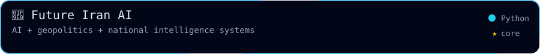
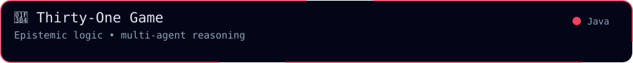
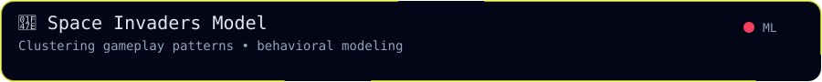

  

  
  
  

  
  
  

---

  <b>Selected work across backend systems, API design, system architecture, and technical experiments.</b>

  This page highlights projects that match the main direction of my GitHub profile: building robust backend services, REST APIs, microservices, and exploring system design & competitive programming.

<h2 align="center">🧪 Project Highlights</h2>

<!-- Row 1 -->

  
  

<!-- Row 2 -->

  
  

<!-- Row 3 -->

  
  

## Project Index

| Project | Focus | Status | Why it matters |
| --- | --- | --- | --- |
| [ADD PROJECT NAME HERE]([ADD URL]) | [ADD FOCUS] | [ADD STATUS] | [ADD DESCRIPTION] |
| [ADD PROJECT NAME HERE]([ADD URL]) | [ADD FOCUS] | [ADD STATUS] | [ADD DESCRIPTION] |
| [ADD PROJECT NAME HERE]([ADD URL]) | [ADD FOCUS] | [ADD STATUS] | [ADD DESCRIPTION] |
| [ADD PROJECT NAME HERE]([ADD URL]) | [ADD FOCUS] | [ADD STATUS] | [ADD DESCRIPTION] |
| [ADD PROJECT NAME HERE]([ADD URL]) | [ADD FOCUS] | [ADD STATUS] | [ADD DESCRIPTION] |
| [ADD PROJECT NAME HERE]([ADD URL]) | [ADD FOCUS] | [ADD STATUS] | [ADD DESCRIPTION] |

## Current Direction

  

## What To Look At First

  

---

<h2 align="center">📊 Activity</h2>

  

  

  
    

